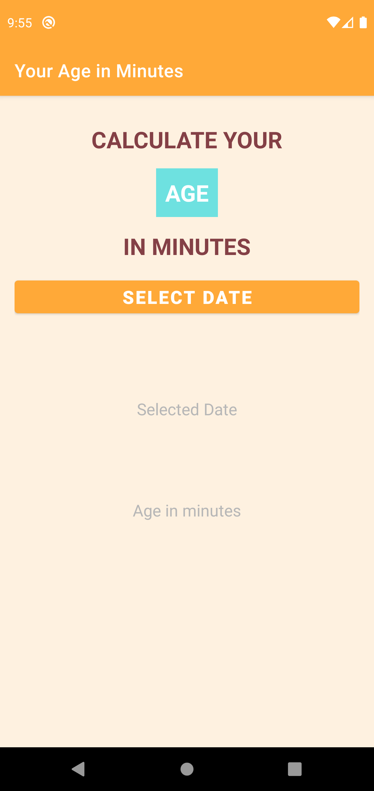
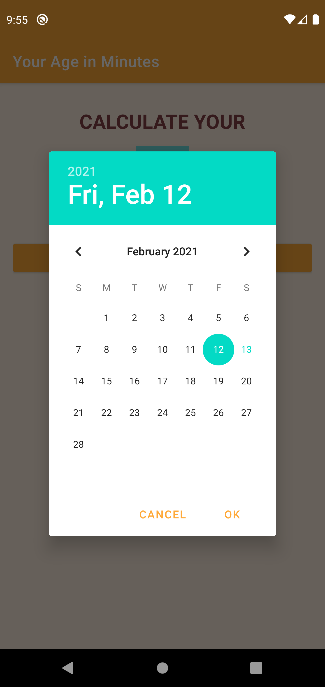
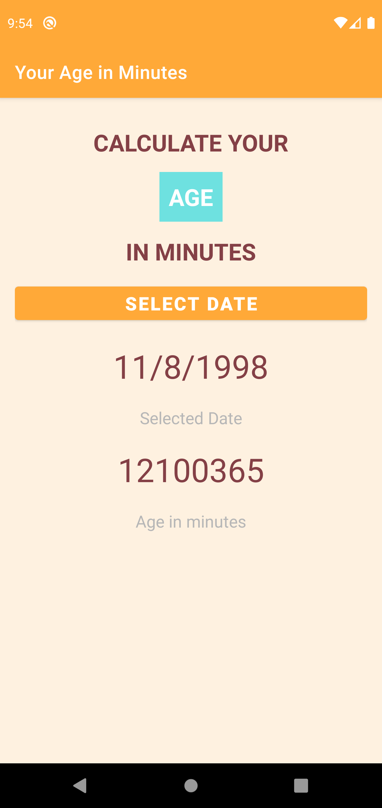

# AgeInMinutes :tada: :rocket:
An android app that will tell the age of person in minutes , written in kotlin

The main idea is , user selects a date and the app will tell , how old is user as per the selected date

## Technologies used :muscle:
- Core Android
- Kotlin

## App UI ( Onboarding and Different Screens)
**App Screens** 

### Made with ❤ by Avijeet , using Kotlin